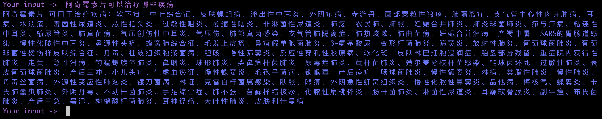

# Question Answer Projects

本项目主要特点：
+ 基于知识
+ 垂直领域
+ rasa框架

本项目包含多个问答子项目：

## 项目1.天气问答Demo
+ 详情参见[rasa_weather_qa](rasa_weather_qa)
+ 效果展示
>执行action命令：rasa run actions --port 5055 --actions actions --debug

>启动shell：rasa shell

## 项目2. 基于RASA的临床诊断问答系统(Clinical Decision Question Answer System)
+ 详情参见[rasa_clinical_decision_qa](rasa_clinical_decision_qa)
+ 效果展示
> 输入你好问候语（intent：greed）

> 输入肺炎，通过模糊查询到所有类型的肺炎供用户选择

> 根据选择，得到该疾病的治疗建议

> 不需要额外提供疾病名字，继续提问基于上一轮聊天疾病的饮食注意什么（因为tracker里存储了）

> 再更换主体，询问药物一般用于哪些疾病

## 项目3. 基于RASA的云平台运维问答系统
+ 详情参见[rasa_cloud_platform_qa](rasa_cloud_platform_qa)
+ 效果展示
>what is the cpu?

>what is the region?

