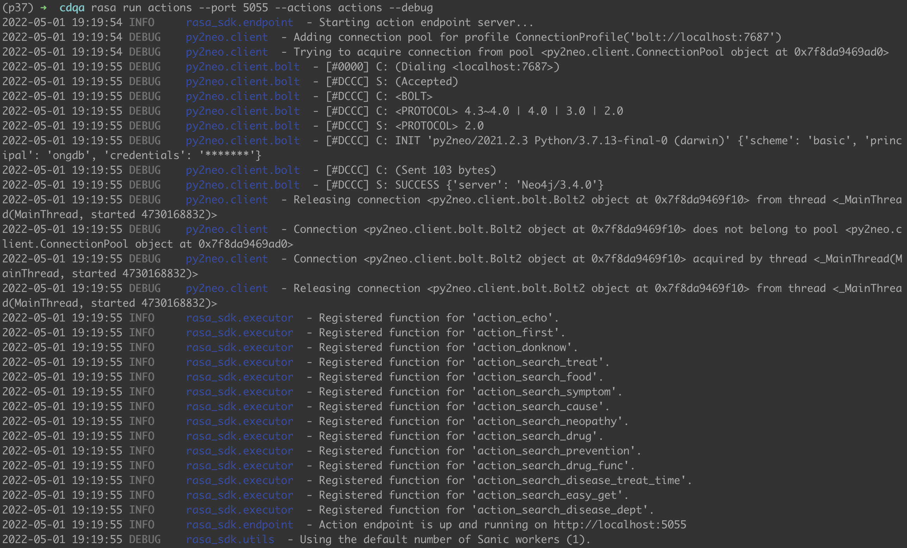
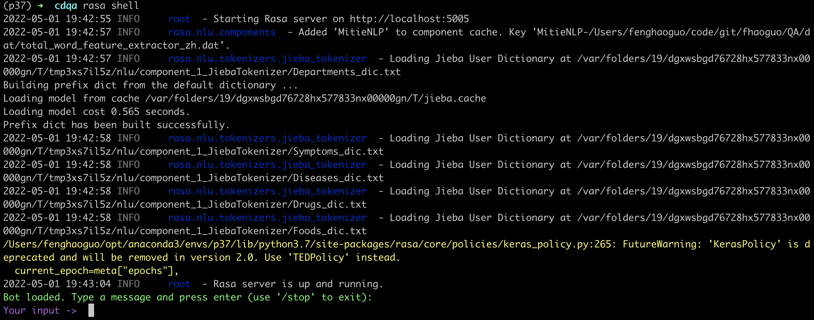

# 基于RASA的临床诊断问答系统(Clinical Decision Question Answer System)

## Requirement
+ python==3.7
+ rasa==1.10.12
+ mitie
+ Neo4j or ONgDB存储图谱并启动

## 1.知识建模
详情参见`知识建模.ipynb`

## 2.KBQA设计
详情参见`KBQA设计.ipynb`

## 3.CDQA系统关键点分析
详情参见`CDQA关键技术点解析.ipynb`

## 4.测试

### 4.1 训练
cdqa目录内执行：
>rasa train

### 4.2 启动action
cdqa目录内执行：
>rasa run actions --port 5055 --actions actions --debug

### 4.3 启动shell
cdqa目录内执行：
>rasa shell

👌🏻，开始临床诊断吧。。。

## 5.效果展示
* 启动action
>执行命令：rasa run actions --port 5055 --actions actions --debug

* 开启一个会话shell
>执行命令：rasa shell

* 输入你好问候语（intent：greed）

* 输入肺炎，通过模糊查询到所有类型的肺炎供用户选择

* 根据选择，得到该疾病的治疗建议

* 不需要额外提供疾病名字，继续提问基于上一轮聊天疾病的饮食注意什么（因为tracker里存储了）

* 再更换主体，询问药物一般用于哪些疾病

## 6.参考
+ https://github.com/rasahq/rasa
+ https://github.com/RasaHQ/rasa-demo
+ https://github.com/liuhuanyong/QASystemOnMedicalKG