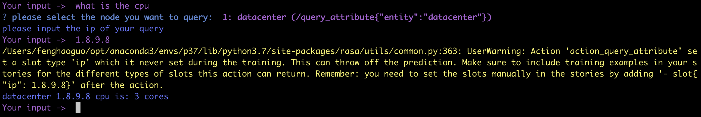

# 基于RASA的云平台运维问答系统
## Requirement
+ python==3.7
+ rasa==1.10.12
+ mitie

## 1.训练
> rasa train

## 2.启动
> rasa run actions --port 5055 --actions actions --debug

> rasa shell

## 3.问答案例
>what is the cpu?

>what is the region?

## 4.退出
>/stop

## 参考
+ https://github.com/rasahq/rasa
+ https://github.com/RasaHQ/rasa-demo
+ https://github.com/Chriszhangmw/rasa_uncertain_slot
